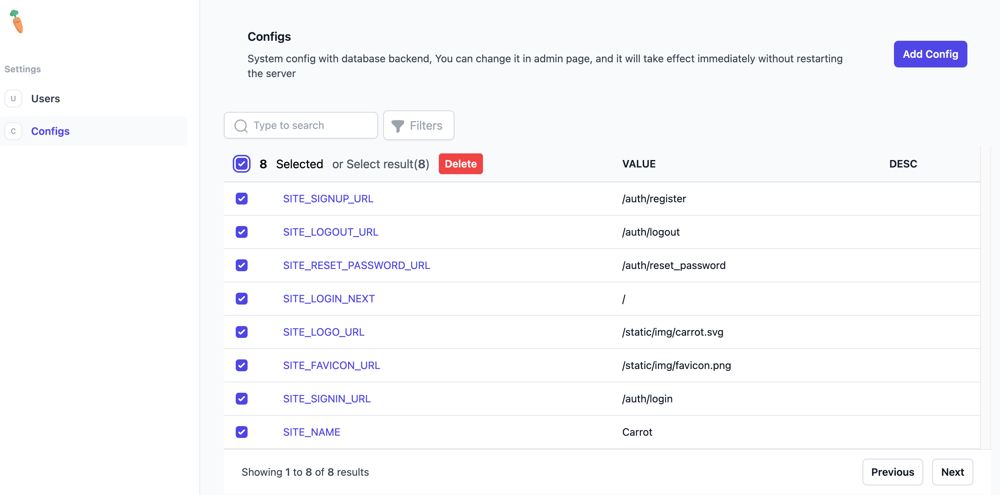
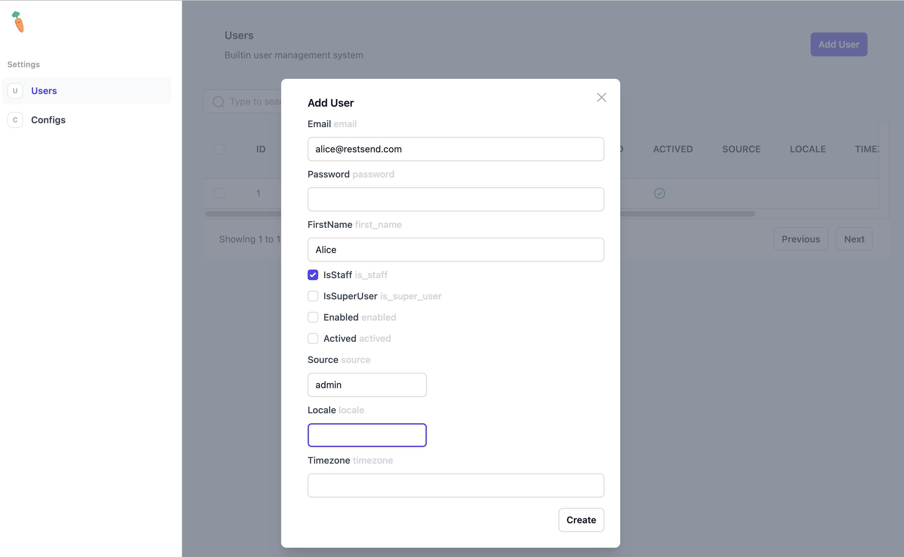

carrot - restsend golang library
====

### Description
Carrot is a golang library for simplifying backend develop. Builtin with a simple admin page for managing the backend. (Use alpinejs for the frontend framework)
- Admin list page

- Admin edit page

### Quick start
See the [examples](examples) directory for a quick start.
